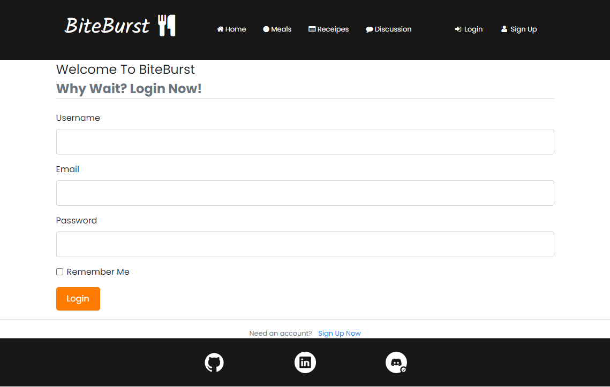
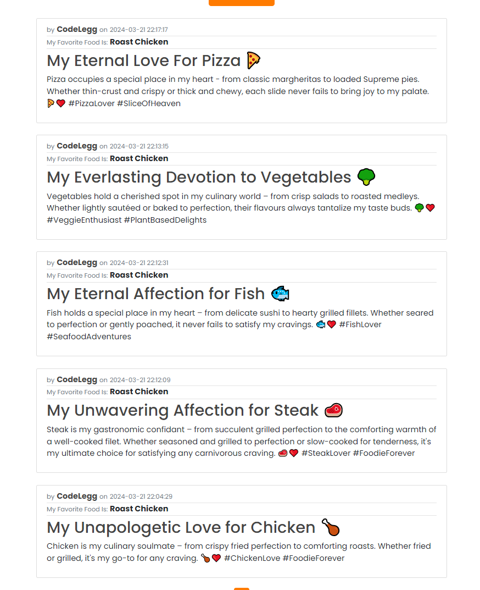
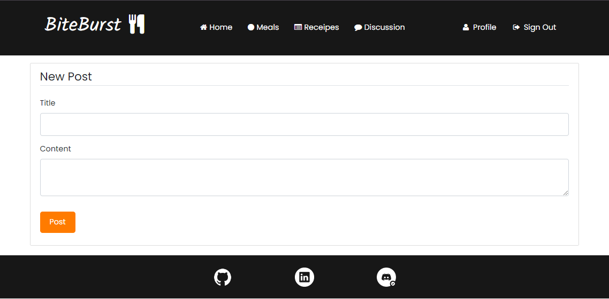
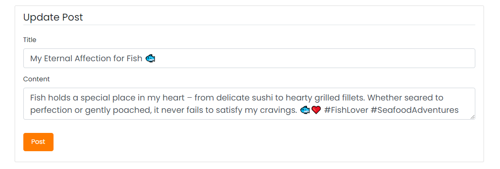

# BiteBurst

BiteBurst is a dynamic web platform that brings food enthusiasts together in a vibrant community space. Powered by HTML, CSS, JavaScript, Python with Flask, and PostgreSQL, BiteBurst offers an immersive experience where users can effortlessly create, read, update, and delete content. With its grid-style homepage, comprehensive CRUD system with a comment section, and a unique feature enabling users to showcase their favorite food within the discussion section, which is customizable in your profile, BiteBurst stands as the premier destination for engaging with food content and connecting with like-minded individuals. Join us today and explore the exciting universe of BiteBurst!

This is Milestone Project 3 for a Level 5 Diploma in Web Application Development.

Link to live site: https://pythonlogin-017f233d45cf.herokuapp.com/

## CONTENTS

- [User Experience](#user-experience-ux)

  - [User Stories](#user-stories)

- [Design](#design)

  - [Colour Scheme](#colour-scheme)
  - [Typography](#typography)
  - [Layout](#layout)
  - [Imagery](#imagery)
  - [Wireframes](#wireframes)
  - [Database Relationships Schema](#database-relationships-schema)
  - [Security](#security)
  - [Future Updates](#future-updates)

- [Features](#features)

  - [Future Implementations](#future-implementations)
  - [Accessibility](#accessibility)

- [Technologies Used](#technologies-used)

  - [Languages Used](#languages-used)
  - [Frameworks, Libraries & Programs Used](#frameworks-libraries--programs-used)

- [Testing](#testing)

- [Deployment](#deployment)

- [Credits](#credits)

  - [Code Used](#code-used)
  - [Content](#content)
  - [Media](#media)
  - [Acknowledgments](#acknowledgments)

  ***

## User Experience (UX)

### User Stories

**User Story 1**

As a passionate food enthusiast, I want to join a food community where I can easily share my cooking experiences, recipes, and culinary adventures. I hope to connect with like-minded individuals, learn new cooking techniques, and discover exciting food trends.

**User Story 2**

As someone who enjoys exploring different cuisines, I'm eager to find a platform that offers a diverse range of food content. I want to read insightful reviews, discover hidden gems in my area, and participate in discussions about food culture and dining experiences.

**User Story 3**

As a home cook looking to expand my culinary skills, I'm seeking a user-friendly platform where I can access a variety of cooking tutorials, tips, and tricks. I hope to find inspiration for new dishes, learn from experienced chefs, and share my own cooking creations with a supportive community.

**User Story 4**

As a professional chef aiming to showcase my culinary creations and establish my brand, I'm excited to utilize Suport as a platform to share my expertise and interact with a diverse audience. I hope to engage with food enthusiasts, receive feedback on my dishes, and collaborate with other chefs to elevate my culinary career.

## Design

### Colour Scheme

color theme of orange, black, and white combines warmth, sophistication, and simplicity to create a visually appealing and engaging aesthetic. The contrast between the boldness of orange and the neutrality of black and white adds visual interest while maintaining readability and clarity.

### Typography

The font used throughout the site is 'Poppins', I have chosen this font because I consider it to be clean and easy to read.

### Layout

The layout of the BiteBurst website is built using the Bootstrap framework, which provides a responsive grid system that allows the website to adapt to different screen sizes and devices. The use of a grid system helps to create a consistent layout on necessary pages of the website, which makes navigation and exploration more intuitive for visitors.

### Accessibility

The site has scored highly in terms of accessibility, I have included alt text descriptions for all images to provide context and information to visually impaired users, Used contrasting colours to enhance accessibility.

### Imagery

Used a combination of imagery from [Foodie](https://www.foodie.com/). The images were chosen to reflect the food theme. Images are all of a similar size and quality for consistency throughout the site.

### Wireframes

[BiteBurst Wireframes](foodblog/static/readme-images/biteburst-wireframes.pdf)

Consistency reigns in my wireframes from inception to completion. I envisioned a dynamic platform comprising a blog-style interface intertwined with an interactive discussion page. Here, users can effortlessly generate, update, peruse, and remove posts, comments, and replies. Additionally, I integrated a feature during sign-up where users indicate their favorite food, adding a personal touch to their profiles. This choice is prominently showcased in the discussion section and can be modified at any juncture, ensuring a tailored and engaging user experience.

### Database Relationships Schema

**User to Posts**

- One to Many.
- Each user can have multiple posts.
- The user object will have a `posts` property to query all related posts. This allows users to create and manage their own posts.

**Post to User**

- Many to One.
- Each post belongs to one user.
- The post object will have a `user` property to query the related user object. This associates each post with its author.

**Post to Comment**

- One to Many.
- Each post can have multiple comments.
- The post object will have a `comments` property to access all comments related to it.

**Comment to Post**

- Many to One.
- Each comment belongs to one post.
- The comment object will have a `post` property to access the post it belongs to. This allows comments to be associated with specific posts.

**User to Comments**

- One to Many.
- Each user can make many comments.
- The user object will have a `comments` property to fetch all comments authored by that user.

**Comment to User**

- Many to One.
- Each comment is authored by one user.
- The comment object will have a `user` property to access the user who authored it. This links comments to their respective authors.

### Security

A number of different security considerations were taken into account when putting together this project.

**Use of .env file**

Vital credentials, such as DATABASE_URL and SECRET_KEY, are stored in a .env file, which is listed in the .gitignore file to maintain its confidentiality. Initially, the SECRET_KEY was stored in the init.py file but has been relocated to the more secure .env file. Additionally, the database was destroyed and reconstructed to generate a new DATABASE_URL.

**Defensive Programming**

The website incorporates various safeguards to restrict unauthorized actions by users. For instance, accessing individual BiteBurst pages or adding a post is restricted to signed-up users only. These restrictions are enforced using the @login_required decorators.

**Password Hashing**

bcrypt: In Flask applications, bcrypt is a widely used library for securely hashing passwords. Password hashing is a crucial aspect of user authentication, as it ensures that passwords are stored securely in the database. Bcrypt employs a strong cryptographic hashing algorithm that incorporates salting and key stretching to protect against various forms of attacks, including brute-force and rainbow table attacks. Salting involves adding random data to each password before hashing, while key stretching involves applying the hashing algorithm multiple times to slow down the hashing process, making it more resilient against password cracking attempts. By utilizing bcrypt, Flask applications can enhance the security of user authentication and safeguard user passwords against unauthorized access.

**Input Validation**

The provided code implements several measures to ensure the integrity and security of user registrations. Firstly, it verifies whether the email already exists in the database to prevent duplicate registrations. Additionally, it enforces validation checks on the length of the email, username, and password to ensure users provide sufficiently complex information. Furthermore, the registration process includes a password confirmation step, where users are required to enter their password twice for verification. In case of mismatch, an error message is displayed to prompt users to rectify the inconsistency.

**Feedback to Users**

Flash messages serve to communicate the outcome of user actions, providing feedback such as successful login or reasons for authentication failure. However, these messages are crafted to maintain a balance between informing users and preserving security. Instead of overly specific errors like "incorrect password for given email," the messages are more generalized, stating 'Email does not exist' or 'Incorrect password, try again.' This approach ensures clarity for users while safeguarding sensitive information.

## Features

### General features

**Sign up**  

Users have the ability to sign up, and must choose their favourite food.

**Log in**  

Users can login using the information that they provided at the sign up process.

**Home page**  

Users are greeted with a homepage featuring interactive images showcasing 12 food card recipes available on the site, including Fish Recipes, Chicken Recipes, Chinese Recipes, Taco Recipes, Sweet Treat Recipes, Baking Recipes, Meat Recipes, and Pasta Recipes. When users hover over the images, they subtly scale up, providing a zoom-out effect for an enhanced user experience.

**Meals page**  
A dedicated page is provided for users to explore a gallery of meal pictures, serving as a source of inspiration. Notably, an engaging transition effect has been implemented, enhancing the user experience. As users scroll through the page, both text and images smoothly slide in from the side, imparting a modern aesthetic to the website.

**Receipes page**  

Individual page where users can select any of the cards, which will then show them a receipe with instructions on how to make it.

**Discussion**

An individual page where users can go to post and interact with other users about Food.

**Post feature & Quick link**

Users have the ability to share content on the discussion page and explore existing posts from other users. The most recent posts appear at the top of the page, ensuring users are promptly presented with the latest content. Quick links are conveniently placed throughout the website, facilitating easy access to posting, checking the latest updates, and editing their own posts by clicking on them.

**Comment feature**

Users have the option to comment on posts authored by themselves or other users. Once added, comments can be deleted. The comments section displays the most recent comments at the top, with older comments appearing towards the bottom.

**Reply feature**

Users have the option to reply on posts & comments authored by themselves or other users. Once added, comments and replies can be deleted. The comments section displays the most recent comments at the top, with older comments appearing towards the bottom.

**Delete modal**  
Users can delete posts and comments and replies once they have added them. A confirmation 'delete modal' is displayed once the user clicks the 'delete' button

**My profile**

Users can visit the 'My profile' page, where they have the option to edit their information and update their favorite food, prominently displayed on their profile and discussion page. Furthermore, users can conveniently explore their previous posts and comments, facilitated by pagination for a seamless browsing experience. Additionally, users can click on their posts or comments to navigate directly to the corresponding unique post or comment.

**Logout**  
Once users are finished on the site, they can click click the sign out button which will take them to the home page.

**Footer**  
Users can navigate to respective social media sites that are present in the footer.

**Flash Messages**  
I chose to use flash messages as a positive feedback to users whenever they made an action on the site. Everything from logging in, to adding a post to try something they aren't authorised to do.

**Creative timestamping**  
I decided to included a date and time that informed users when the post was created and what time it was posted. I think this makes it easier to remember when the post was created.

### Future Implementations

There are a number of different features that could be implemented in the future;

- Private messaging function that allows users to message directly.
- More interactive profiles that allow users to upload images and other content.
- The ability to view other users profiles.

## Technologies Used

### Languages Used

**HTML5**  
Used for creation of markup for the website content.  
**CSS**  
Cascading style sheets used to style the individual pages.  
**Javascript**  
Used to toggle visibility of certain aspects of the site.  
**Python**  
Used to run the app.

### Frameworks, Libraries & Programs Used

[Bootstrap 4.4.1](https://getbootstrap.com/)  
Boostrap was predominantly used throughout the site for responsiveness, modals to confirm deleting posts/comments and image carousel.

[CDN jsdelivr](https://www.jsdelivr.com/)  
CDN jsdeliver was used to serve static assets bootstrap and jquery to improve performance and reliability.

[Google Fonts](https://fonts.google.com/)  
Used to import '' font.

[Font awesome](https://fontawesome.com/)  
Used to import icons on to the site to improve user experience.

[Github](https://github.com/)  
GitHub is used to store the projects code after being pushed from Git.

[Balsamiq](https:/balsamiq.com)  
Balsamiq was used to create the wireframes during the design process.

[Heroku](https://id.heroku.com/login)  
Used to deploy the project.

[Flask](https://flask.palletsprojects.com/en/3.0.x/#)  
Python framework that has provided tools and features to build my web application.

[Jinja](https://jinja.palletsprojects.com/en/3.1.x/)  
Assisted me in generating dynamic HTML content based on templates and data.

[PostgreSQL](https://www.postgresql.org/)  
Hosted the database used in my project.

[Visual Studio Code](https://code.visualstudio.com/download)  
Visual Studio Code was use to create files pages and where i produced the code for the project.

[Google Chrome Dev Tools](https://developer.chrome.com/docs/devtools/)  
Google Chrome Dev Tools was used during the testing phase to test the responsiveness of the site and to check for any bugs.

[Foodie](https://www.foodie.com//)  
Utilized Foodies images accessed through Dev Tools for the cards, recipes pages, and homepage design.

[W3schools](https://www.w3schools.com/)  
W3schools was used as a guide for HTML, CSS and Python basic principles.

## Testing

Testing process can be found [here]()

## Deployment

**How was this site deployed?**

The website was initially deployed on Heroku.

**Deploying on Heroku**  
The following steps will need to be taken to deploy the application using Heroku.

- Create a requirements.txt file.
- Create a Procfile by typing echo web: python app.py > Procfile. Ensure it starts with a capital P.
- Go to Heroku. Log in or create an account.
- Click the 'New' button and click 'Create new app'.
- Enter a unique name for your project with no capital letters or spaces and select your region. Click 'Create App'.
- Inside your project, go to the Resources tab and create a Heroku Postgres Database.
- Inside your project, go to the 'Settings' tab. Scroll down and click 'Reveal Config Vars'.
- Add in the following variables.
  - SECRET_KEY : Your secret key
  - DATABASE_URL: your postgres database URL
- Deploy your project by going to the Deploy tab and choose 'Connect to Github'
- Find your repository name and select Connect.

**Create a new repository on GitHub**

- Add the necessary files to the repository.
- Go to the settings page of the repository, located on the menu bar towards the top of the page, scroll down to the GitHub Pages section which is located at the bottom of the 'Code and automation' sub-section.
- Select the main branch and the root folder, then click save.
- The website will now be live at the URL provided in the GitHub Pages section.

**How to clone the repository**

- Go to the (https://github.com/CodeLegg/Milestone-3) repository on GitHub.
- Click the "Code" button to the right of the screen, click HTTPs and copy the link there.
- Open a GitBash terminal and navigate to the directory where you want to locate the clone.
- On the command line, type "git clone" then paste in the copied url and press the Enter key to begin the clone process.

**How to Fork the repository**

- Go to the (https://github.com/CodeLegg/Milestone-3) repository on GitHub.
- Click on the 'Fork' option towards the top left of the page.
- Click the dropdown button and click 'create a new fork'.
- This will bring up a page with details of the repository, fill in boxes as required.
- Click 'create fork'.

For further guidance [click here](https://docs.github.com/en/get-started/quickstart/fork-a-repo)

Forking this repository will allow changes to be made without affecting the original repository.

## Credits

### Code Used

Bootstrap v4.4.1

- Delete Modal used from bootstrap.

- Code Institute training material

Followed tutorials from [Corey Schafer](https://www.youtube.com/@coreyms) to better understanding.

Used [Flask tutorials](https://flask.palletsprojects.com/en/2.3.x/tutorial/views/) to better understanding.

### Content

### Media

**Images**

### Acknowledgments

Code Institute training material.
