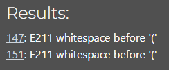
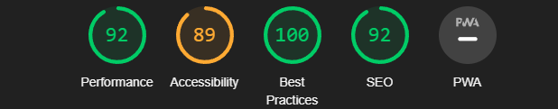

# Testing

## Contents

This site has been tested using the following testing procedures

* [Code Validation](#Code-validation)  

* [Lighthouse Testing](#Lighthouse-Testing)

* [Browser Compatibility](#Browser-Compatibility)

* [Automatic Testing](#Automatic-Testing)

* [Manual Testing](#Manual-Testing)

* [Bug Reporting](#Bug-Reporting)

## Code Validation    

The site has been run through [W3C](https://validator.w3.org/), [WC3 CSS](https://jigsaw.w3.org/css-validator/), [JSHint](https://www.jshint.com/) javascript validator and CI [PEP8 validator](https://pep8ci.herokuapp.com/) 

**HTML** 

No warnings/errors were present when running my site through W3C validator.  

**CSS**

  

No errors were present when running my site through W3C CSS validator.  
  

**Javascript**

  

There were no errors when running javascript file through JShint validator.  

**Python**

I ran my Python code through a PEP (Python Enhancement Proposal) Linter for continuous integration (CI) and encountered character errors in two files. Despite my efforts to shorten the lines, it led to syntax errors in my Integrated Development Environment (IDE).

  
  

## Lighthouse Testing  

All pages passed lighthouse testing scoring average/good scores 

**Sign up**  

  

**Log in**  

  

**Overview**  

  

**Meals**  

  

**Receipes**  

  

**Receipes blog page**  

  

**Profile**  

  

**Disscussion page**  

  

## Browser Compatibility 
  
**Desktop**  

| Browser            | Version                                               | Bugs  |
| -------------      |:-------------:                                        | -----:|
| Google Chrome      | Version 112.0.5615.138 (Official Build) (64-bit)      | None  |
| Microsoft Edge     | Version 112.0.1722.58 (Official build) (64-bit)       | None  |
| Firefox            | 112.0.1 (64-bit)                                      | None  |  

**Mobile**  

| Device                   | Operating system | Bugs  |
| -------------            |:-------------:   | -----:|
| iPhone 14                | iOS 16.6.1       | None  |
| iPhone 14 pro            | iOS 16.6.1       | None  |
| iPad 10                  | iOS 16.6         | None  |
| Samsung Galaxy S22 ultra | Android 14.0     | None  |
| HONOR Magic5 Pro         | Android 13.0     | None  |
| iPhone 13 pro            | iOS 16.6         | None  |

## Manual Testing  

During the manual testing, I tested the sites functionality, usability and responsiveness.  

I have kept the basic functionality of the site the same throughout the entire project. Initially leaning towards a note/review site, moving towards a social media site that allows users to create, edit and delete posts.  
 

#### Functionality

**General**

Navbar links - All navbar links work as expected.  
Sign up - Signup works as expected with errors handled as expected.  
Login - Login works as expected.  
Flash messages - All flash messages are correctly implemented, both success and error flash messages are displayed correctly.  
receipe cards - The interactive food cards work as expected on the home and receipe pages.  

**Disscussion page** 

Post function - The post feature works as expected.  
Edit Post - Edit post feature works as expected.  
Delete Post - Delete post works as expected.  
Comment - The comment feature works as expected.  
Delete Comment - The delete comment feature works as expected.  

**Profile**

Edit fav food - The edit fav food works as expected.  
update button - The update buttons both work as expected.
Social media footer - The social media icons work as expected.  
Delete modal - The delete modal opens as expected and deletes content when clicked.  
Logout - The logout feature works as expected.  

**Responsiveness**  

Website is Responsive On mobile devices, all elements are displayed correctly and can be interacted with easily.  The website is fully responsive to different screen sizes.

## Bug Reporting
Throughout the development phase of the site, I came across a variety of different bugs/errors that eventually overcame.  

**resolved**

Had issue with layout.html  not rendering due to a typo in html file name, now fixed.  

**Unresolved**

-PEP8 Linter caling out errors

- footer will not sit at the bottom of the screen.  This is due to a css issue that needs to be fixed in order for the footer to stay at the bottom.

    

[Back to README.md](https://github.com/CodeLegg/Milestone-3)